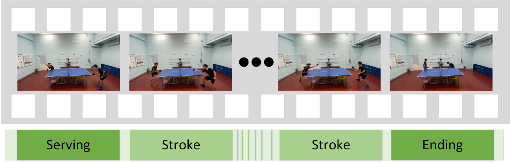
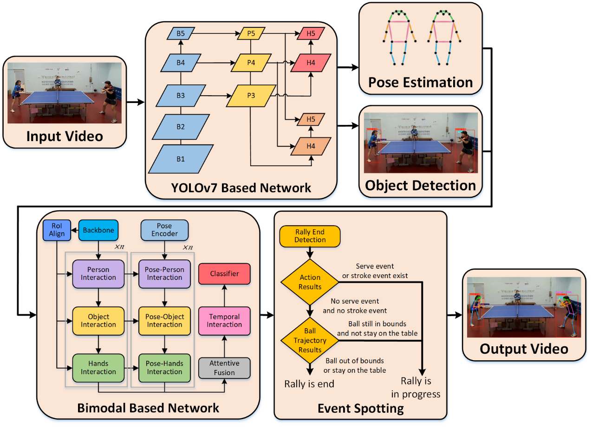
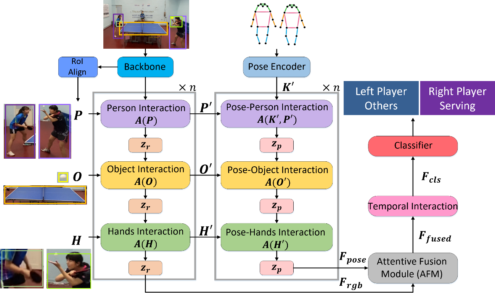

# Table Tennis Referee System Using Multimodal Deep Learning

## Abstract

This study pioneers the use of bimodal action recognition for table tennis video analysis, integrating RGB images and pose data to detect rally events.
A YOLOv7-based framework with pose estimation distinguishes ball, player, and table positions, enhancing system speed and accuracy.
By combining ball trajectories with player actions, the system identifies rally start and end times, embedding results into output videos for easy analysis.

---

## Method Flowchart

The workflow of this study is as follows:

1. First, object detection is performed on the input video to identify the ball, players, and table, along with human pose estimation.
   An object detection model is used to predict the bounding boxes for each object, while pose estimation is applied to the players to detect key body joint coordinates.
2. Next, a bimodal deep learning network is built using these two types of data to perform action recognition for each player.
   The ball trajectory coordinates and the action recognition results are then used to determine the conclusion of a table tennis point.
3. Finally, the results are integrated and displayed in the output video.

---

## Bimodal-based Action Recognition Model

This study aims to detect the start of each point in a table tennis match by identifying the **serve actions**, thereby enabling accurate recognition of players' continuous movements within each frame.

Recent works have leveraged **spatiotemporal convolutional networks** to capture both **spatial** and **temporal motion features** in video frames, enhancing action recognition performance.
However, these methods often overlook the **interactions between players and surrounding objects**, such as the **ball's movement across the table**, which is vital to the hitting process.

To address this gap, we propose a **dual-modal approach** that incorporates both **player-environment interactions** and **human pose estimation**.
The model utilizes the **SlowFast network** for feature extraction, processing both **slow** and **fast temporal scales** to capture long- and short-term motion information.
**Region of Interest (RoI) alignment** is employed to focus on key objects and players by applying the detected bounding boxes.
Additionally, we introduce **interaction modules**—**person-to-person**, **person-to-object**, and **hands-to-object interactions**—capturing complex relationships between the target objects.
These interactions are computed using a **cross-attention mechanism**, followed by **intra-modality aggregation** to refine the extracted features.
Finally, **temporal interaction** and **feature fusion modules** are applied to integrate information across both time and modalities, resulting in improved action classification accuracy.

